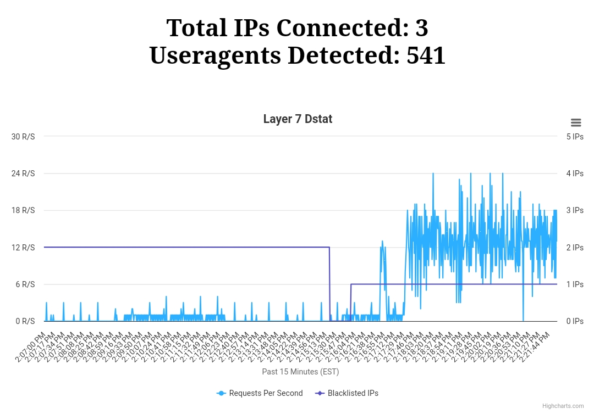
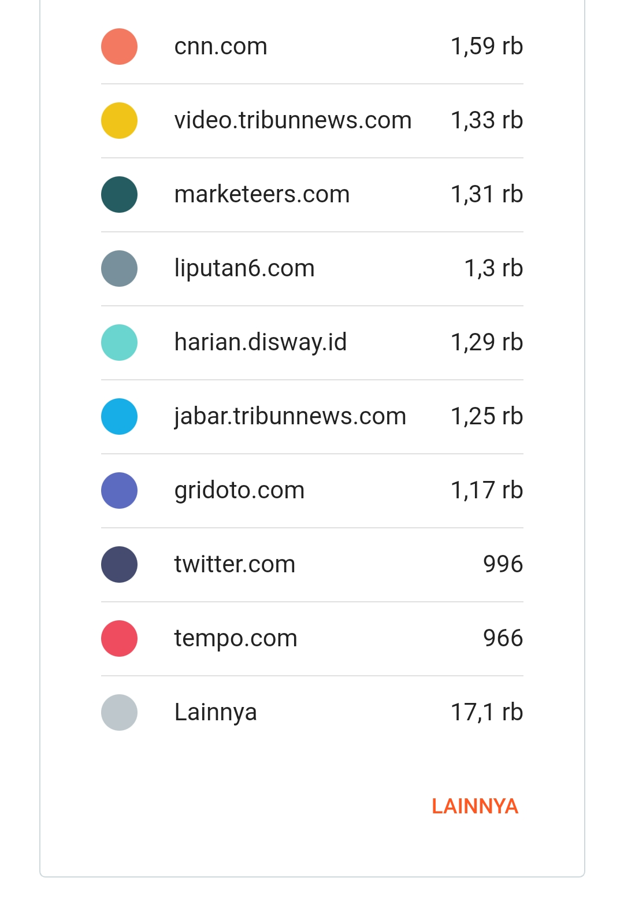
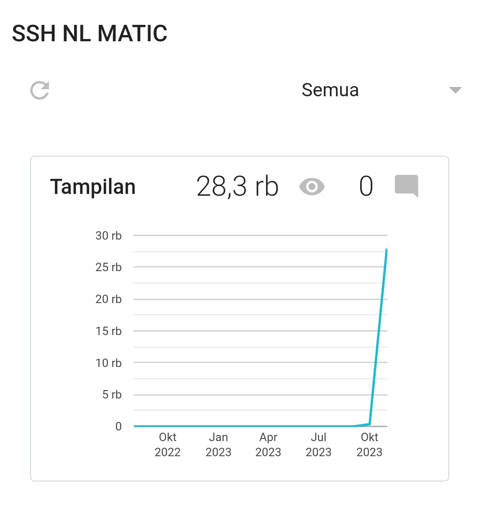

## ⚠️ HTTP FLOOD REQUEST

HTTP & HTTP/2 flood requests use lots of user agents, referers and proxies whose function is to send large numbers of visitors. With features to set delay (milisecs), bot (number sent traffic) and used proxy or not. 

<center></center>

#### 🚀 Ready to go

```bash
npm install httpsflood
```

```bash
chmod 777 ddos.sh
```

#### 🖼 Blogger statistic

<center></center>
<center></center>


## 📝 License

This project is licensed under the [AGPL-3.0 License](https://github.com/naix0x/httprequest/blob/main/LICENSE).

